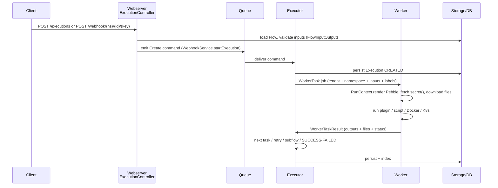
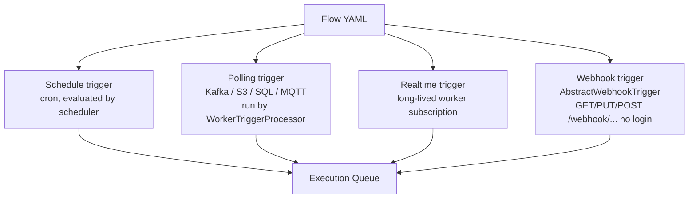

# 02 — Architecture of Kestra (Develop Branch)

> Modules listed in `settings.gradle:19-49`. Entry point: `cli/src/main/java/io/kestra/cli/Kestra.java` + `cli/.../servers/*Command.java`.

## 1. Big picture — 30 seconds

```
You (UI/CLI/API/Terraform/Git)
   → Webserver (accepts work, stores Flows)
   → Queue (pending work)
   → Executor (brain: decides what runs next)
   → Worker (hands: runs tasks, plugins, scripts)
   → Storage + DB (files, secrets, results)
   → Scheduler (clock: wakes up Flows on time/event)
```

Kestra separates **deciding** (Executor) from **doing** (Worker) so it can scale horizontally and survive crashes.

## 2. Module map — what each folder does

| Module | Role | Key classes |
|---|---|---|
| `cli/` | Bootstraps everything: `server local/standalone`, `executor`, `scheduler`, `worker`, `webserver` | `cli/.../servers/ServerCommand.java`, `StandAloneRunner.java` |
| `core/` | Shared models: Flow, Execution, Task, Trigger, Storage, Secrets, Pebble | `core/.../models/flows/`, `runners/DefaultRunContext.java`, `services/WebhookService.java` |
| `webserver/` | REST API + UI backend (Micronaut). 28 `@Controller`s | `webserver/.../controllers/api/ExecutionController.java`, `FlowController.java` |
| `executor/` | State machine: `CREATED → RUNNING → SUCCESS/FAILED`, handles retries, subflows, kill | `executor/.../DefaultExecutor.java`, `ExecutorService.java`, `handler/*` |
| `scheduler/` | Fires `Schedule` + polling triggers on time | `scheduler/.../DefaultScheduler.java`, `TriggerSchedulingLoop.java`, `SchedulableEvaluator.java` |
| `worker/` | Executes one task at a time, renders variables, fetches secrets, runs plugin/script | `worker/.../WorkerJobExecutor.java`, `processors/WorkerTaskProcessor.java` |
| `worker-controller/` | Assigns jobs to workers (gRPC / direct queue) | `worker/.../queues/`, `services/GrpcWorkerConnectionService.java` |
| `queue/ + queue-jdbc/` | Internal message bus (in-memory or JDBC-backed) | `DispatchQueueInterface`, `BroadcastQueueInterface` |
| `jdbc/ + jdbc-h2/mysql/postgres/` | Persistence for Flows, Executions, Logs, Triggers, KV | `ExecutionRepositoryInterface`, `FlowRepositoryInterface` |
| `storage-local/` + S3/GCS plugins | File artifacts, namespace files, `trigger.parts` uploads | `core/.../storages/StorageInterface.java` |
| `indexer/` | Search + metrics + daily stats | `indexer/` |
| `model/processor/script/` | Plugin SDK, script-task base (Python/Node/Shell) | — |
| `ui/` | Vue 3 + TypeScript + Element Plus frontend | `ui/src/` |

## 3. Diagram 1 — System components

```mermaid
flowchart LR
  User[UI / CLI / Terraform / Git Sync] --> WS[webserver<br/>Micronaut REST /api/v1/{tenant}/...]
  WS --> DB[(JDBC DB<br/>Postgres / MySQL / H2)]
  WS --> EQ[ExecutionCommand Queue<br/>queue + queue-jdbc]
  SCH[scheduler<br/>cron + polling] --> EQ
  EQ --> EX[executor<br/>DefaultExecutor state machine]
  EX --> WQ[Worker Queue<br/>gRPC / JDBC]
  WQ --> W[worker<br/>plugin + script + Docker/K8s]
  W --> ST[(Storage<br/>local / S3 / GCS + KV + Secrets)]
  W --> EX
  EX --> DB
  EX --> IDX[indexer<br/>search + stats]
```

## 4. Diagram 2 — One execution, step by step



Code trail: `ExecutionController.java:592 triggerExecutionByPostWebhook` → `WebhookService.java:133 newExecution` + `:213 startExecution` → `executor/DefaultExecutor.java` → `worker/processors/WorkerTaskProcessor.java` → `core/runners/DefaultRunContext.java`.

## 5. Diagram 3 — Trigger types



Interfaces: `core/.../models/triggers/TriggerInterface.java`, `PollingTriggerInterface.java`, `RealtimeTriggerInterface.java`, `Schedulable.java`. Webhook plugin base: `io.kestra.plugin.core.trigger.AbstractWebhookTrigger`.

## 6. Data that flows with every run

- **Inputs:** typed (`STRING`, `DATE`, `FILE`, `SECRET`), validated by `FlowInputOutput.readExecutionInputs`.
- **Variables:** `flow.*`, `execution.*`, `trigger.*`, `vars.*`, `env.*` — built by `RunContextFactory` + `RunVariables.java`.
- **Secrets:** `{{ secret('API_KEY') }}` resolved server-side via `SecretService` / `SecretPluginInterface` (Vault, AWS SM, etc.).
- **Files:** per-execution isolated prefix via `StorageContext` + `StorageInterface`; webhook multipart parts land as `trigger.parts` URIs.
- **Outputs + Metrics + Logs:** collected by `ExecutionOutputService`, `MetricRegistry`, `ExecutionLogService`, then indexed.

## 7. How it runs locally vs prod

- `docker run kestra/kestra:latest server local` → `LocalCommand.java` → in-memory queue + H2 + local storage. Mounts `/var/run/docker.sock` so script tasks can launch Docker siblings (convenient, insecure — see file 03).
- Prod: `webserver + executor + scheduler + worker` as separate processes/pods, Postgres/MySQL, S3/GCS storage, external secrets manager, reverse proxy + SSO (EE) in front.
