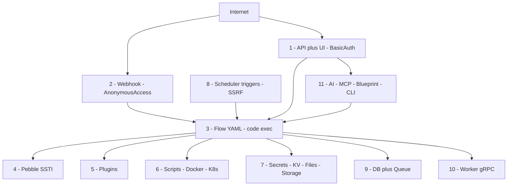

# 04 — How Many Attack Surfaces Does Kestra Have?

> Short answer: **11 distinct attack surfaces** in this `develop` tree. Count them by trust boundary, not by endpoint — otherwise you'd count 28 controllers and miss the point.

## 1. The count

| # | Attack surface | Trust boundary crossed | Risk if ignored |
|---|---|---|---|
| 1 | REST API + Web UI | Internet → Micronaut controllers | Full account + data takeover |
| 2 | Webhook triggers (no login) | Internet → execution engine | Unauthenticated RCE-trigger + DoS/bill shock |
| 3 | Flow YAML as code | Editor → worker code exec | Intended RCE by malicious insider |
| 4 | Pebble `{{ }}/` rendering | Data → template engine (SSTI) | Secret/env leak, logic bypass |
| 5 | Plugins + auto-install | Registry → JVM | Supply-chain RCE |
| 6 | Script + Docker/K8s runners | Flow → host/container runtime | Host escape, cluster takeover |
| 7 | Secrets / KV / namespace files / storage | Execution → credential + file plane | Lateral movement, tenant escape |
| 8 | Scheduler + polling/realtime triggers | Engine → external systems (SSRF) | Internal network + creds abuse |
| 9 | DB + internal queue | App → persistence/bus | Injection, forgery, DoS |
| 10 | Worker gRPC control plane | Worker ↔ controller | Job/secret theft, fake results |
| 11 | AI/MCP/Blueprints + CLI/observability | LLM/import/ops → engine | Prompt-injection actions, malicious import, version leak |

Why 11 and not 30: surfaces 1–2 are the only ones reachable without credentials; 3–7 all follow from "can write a Flow"; 8–11 are the supporting planes (time, state, compute, assistants) that a Flow can abuse.

## 2. Visual — where they sit

## 3. Which 3 matter most (do these first)

1. **#2 Webhooks** — the only unauthenticated door into execution. Long random `key`, HMAC check in `conditions`, throttling, `disabled:true` switch. See `ExecutionController.java:568-653`, `WebhookService.java:113-200`.
2. **#3 + #6 Flow-write = root** — gate who can write Flows (namespace RBAC, PR review for Git-synced flows, separate run-only role), run workers non-root without `docker.sock`, per-tenant pools. See `WorkerSecurityService.java:11`, `README.md:97-103`.
3. **#7 Tenant isolation** — one tenant must never read another's secrets/KV/files/executions. Enforce at DB query (`TenantService.resolveTenant()`), storage prefix (`StorageContext`), and queue routing (`WorkerQueueRouting`). This is what makes Acxiom/Sopht-style multi-tenancy safe.

## 4. How to verify you are safe (quick checklist)

- `GET /api/v1/...` without cookie/token → 401 (except `/webhook/*` + `/misc/configs` intentionally public).
- `POST /webhook/...` with wrong `key` → no execution; with flood → throttled, not OOM.
- Flow containing `{{ secret('X') }}` in a `Log` task → secret masked in `LogController` + UI, not plaintext.
- `/expressions/render` with `secret()/env()` → returned as `[secret: KEY]` / raw, not resolved.
- Plugin install requires admin + pinned version; community Blueprint import requires review.
- Worker has no `docker.sock`, runs as non-root, gRPC uses mTLS/token on private network.
- `npm run translations:check`-style gate for secrets: no `password/pass/secret/token` literal in Flow YAML committed to Git.

---
Files in this set: `01-what-is-kestra.md` (what + who), `02-architecture.md` (how it fits together), `03-attack-surfaces.md` (each surface in depth), `04-attack-surface-count.md` (this count + priorities).
